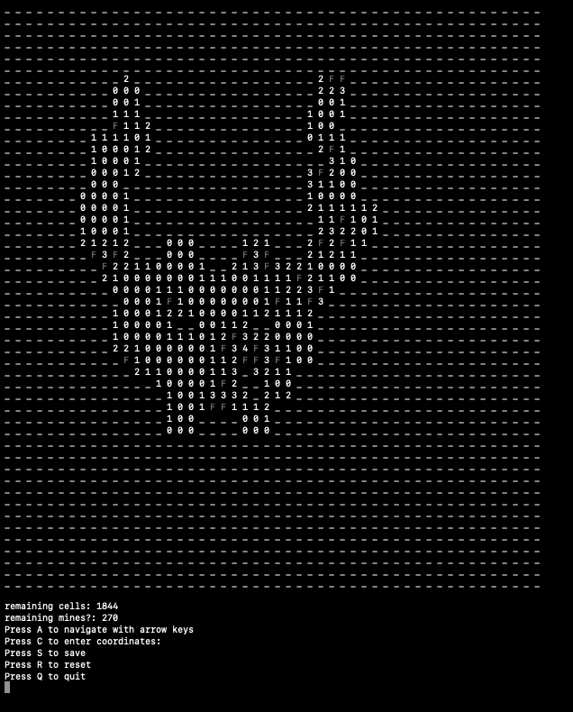
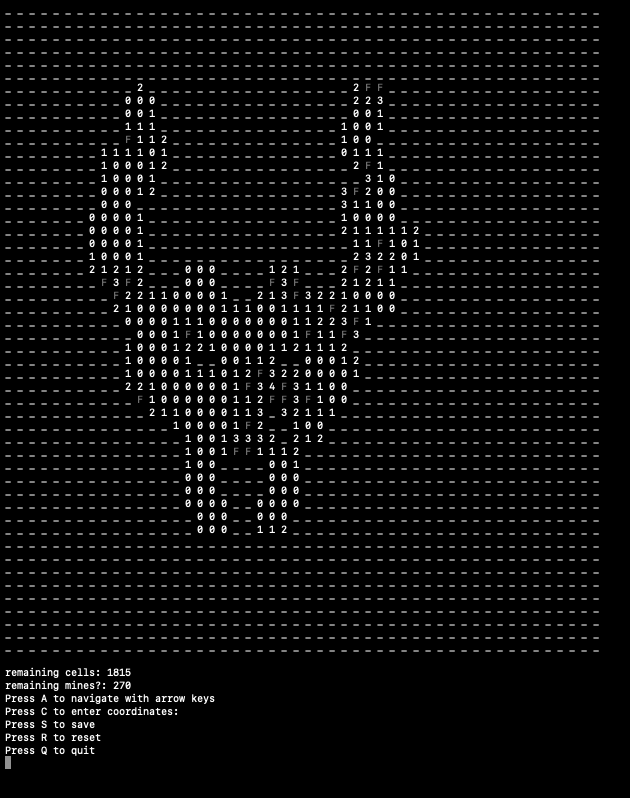
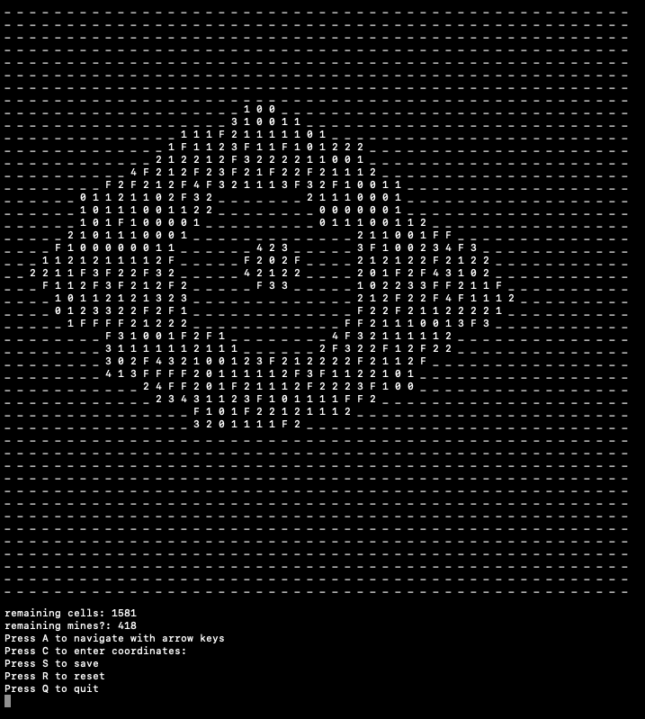

# minesweeper

This is a simple minesweeper game I created as practice while learning ruby. It runs in terminal. 

Begin by entering the board (grid) size, which is the square root of the desired number of cells. For instance, for a game with 100 cells, enter 10 (10 x 10 = 100). Next, enter the desired number of mines. Board size and number of mines are theoretically unlimited. You could enter 100 for board size if you would like to play a game with 10,000 cells, but you might have to zoom out. 

default values:

If you do not specify a board size, the board will be 9x9. 

If you do not specify a number of mines, there will be 18 mines unless this number exceeds the maximum supported by the board size (e.g. if the board is 4x4), in which case you will be prompted to enter a compatible number of mines. 

Input:

Navigate with arrow keys (or enter numeric coordinates if you prefer).

Press Q to quit 
Press R to reset 
Press S to save

Status:

Remaining cells: displays the number of unrevealed cells.

Remining mines?: displays the total number of mines *minus* the total number of flags. If a flag is erroneously placed, this number will still decrement to avoid tipping you off. 

Comments: there are no tests written for this game, since I had not yet learned how to write tests when I created this. However, I tested it manually in pry, and it works. Enjoy.

Images:

