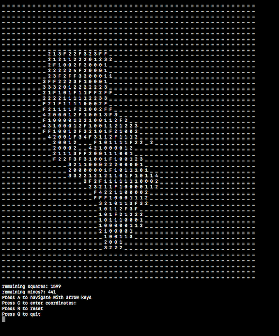
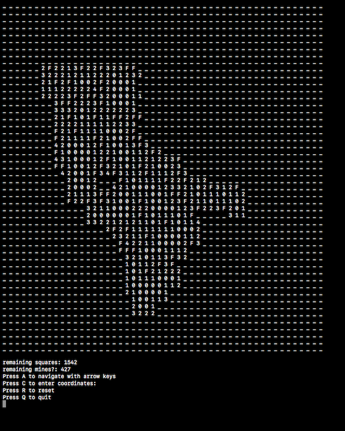
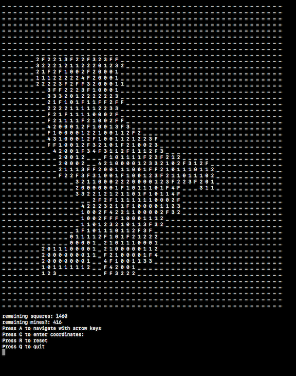

# minesweeper

This is a simple minesweeper game I created as practice while learning ruby. It runs in terminal. 

Begin by entering the board (grid) size, which is the square root of the desired number of cells. For instance, for a game with 100 cells, enter 10 (10 x 10 = 100). Next, enter the desired number of mines. Grid size and number of mines are both theoretically unlimited. You could enter 100 for board size if you would like to play a game with 10,000 cells, but you might have to zoom out. If you do not enter numeric input, the game defaults to a 9x9 grid with 18 mines.

Input:

Navigate with arrow keys (or enter numeric coordinates if you prefer).

Press Q to quit 
Press R to reset 
Press S to save

Status:

Remaining cells: shows the number of uncovered cells
Remining mines?: shows the total number of mines minus the total number of flags. If a flag is erroneously placed, this number will still decrement to avoid tipping you off. 

Comments: there are no tests written for this game, since I had not yet learned how to use rspec when I created this. However, it does work. Enjoy.

Images:

